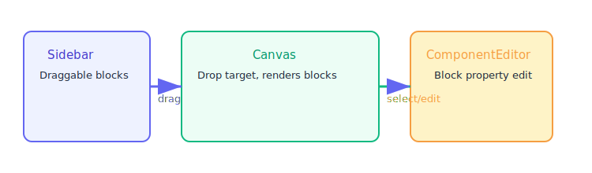

# Documentation: Drag-and-Drop Page Builder (`drag-drop-designer-kit`)

## Project Overview

This project is a modular React (TypeScript) visual builder, allowing users to construct web pages by dragging UI components from a sidebar onto a live canvas. The architecture and approach are inspired by advanced tools like [shuffle.dev/editor](https://shuffle.dev/editor). This documentation provides an in-depth guide for contributors, including technical stack, folder structure, drag-and-drop flow, SVG diagrams (see `/docs/images/`), and practical extension examples.

---

## Technical Stack

- **Frontend Framework:** React
- **Build Tool:** Vite
- **Styling:** TailwindCSS
- **Drag and Drop:** react-dnd + react-dnd-html5-backend
- **Unique IDs:** uuid

---

## Complete Folder Structure

```
drag-drop-designer-kit/
├── public/
│   └── ... (icons, images, static assets)
├── src/
│   ├── App.tsx                     # App root
│   ├── main.tsx                    # Main entry point
│   ├── index.css                   # Tailwind & global styles
│   ├── components/
│   │   ├── builder/
│   │   │   ├── Canvas.tsx                # Main drop area
│   │   │   ├── ComponentEditor.tsx       # Edit dropped components
│   │   │   ├── ComponentLibrary.tsx      # Sidebar block list
│   │   │   ├── SortableComponent.tsx     # Drag-sort logic
│   │   │   ├── WebsiteBuilder.tsx        # Builder page controller
│   │   │   └── components/
│   │   │       ├── ButtonBlock.tsx           # Example: Button block implementation
│   │   │       ├── CardBlock.tsx             # Example: Card block implementation
│   │   │       └── ... (more blocks)
│   │   └── ui/
│   │       ├── accordion.tsx
│   │       ├── alert.tsx
│   │       ├── button.tsx
│   │       ├── card.tsx
│   │       └── ... (core UI units)
│   ├── hooks/
│   │   ├── useBuilderState.ts          # Canvas state logic
│   │   ├── useDragDrop.ts              # Drag/Drop helpers
│   │   └── ...
│   ├── lib/
│   ├── pages/
│   │   └── index.tsx                   # Entry route/page
│   ├── types/
│   │   ├── builder.ts                  # Types for blocks, canvas state
│   │   └── ...
│   ├── utils/
│   │   ├── id.ts                       # Unique ID generator
│   │   └── ...
│   └── vite-env.d.ts
├── components.json                     # List/metadata of components
├── docs/
│   └── images/
│       ├── architecture-overview.svg
│       └── drag-drop-flow.svg
├── README.md
├── tailwind.config.ts
├── postcss.config.js
├── tsconfig.json
├── tsconfig.app.json
├── tsconfig.node.json
├── vite.config.ts
├── index.html
├── bun.lockb / package-lock.json
```

---

## Core Architecture & Visuals

### 1. High-Level Architecture


- **ComponentLibrary** (Sidebar): Lists all available UI blocks to drag.
- **Canvas**: The main drop area where blocks are placed, sorted, and rearranged.
- **ComponentEditor**: The panel for editing the properties of a selected block.

---

### 2. Drag-and-Drop Flow



- **Sidebar** (ComponentLibrary): User picks and drags a block.
- **Canvas**: Receives block, updates state, renders it live.
- **ComponentEditor**: When a block is selected, its properties can be edited here.

---

## Step-by-Step Example: Adding and Editing a Button Block

### 1. Sidebar: Add Button to Canvas

**File**: `src/components/builder/ComponentLibrary.tsx`

```tsx
blocks.map(block => (
  <div
    key={block.type}
    draggable
    onDragStart={e => onDragStart(e, block)}
    className="mb-2 p-2 rounded hover:bg-violet-100"
  >
    <span>{block.icon}</span> {block.label}
  </div>
));
```

### 2. Canvas: Receive Drop

**File**: `src/components/builder/Canvas.tsx`

```tsx
const handleDrop = (block, position) => {
  addBlockToCanvas({
    id: uuid(),
    type: block.type,
    props: block.defaultProps,
    position,
  });
};

blocksOnCanvas.map(data => (
  <SortableComponent key={data.id} {...data} />
));
```

### 3. SortableComponent: Move & Select

**File**: `src/components/builder/SortableComponent.tsx`

```tsx
export const SortableComponent = ({ id, type, props, position }) => (
  <div
    style={{ position: 'absolute', left: position.x, top: position.y }}
    onClick={() => selectBlock(id)}
    className="cursor-move"
    draggable
    onDragEnd={e => onReorder(e, id)}
  >
    {renderBlock(type, props)}
  </div>
);
```

### 4. Edit Properties

**File**: `src/components/builder/ComponentEditor.tsx`

```tsx
const ComponentEditor = ({ selectedBlock }) => (
  <form>
    {Object.entries(selectedBlock.props).map(([key, value]) => (
      <input
        key={key}
        value={value}
        onChange={e => updateBlockProp(selectedBlock.id, key, e.target.value)}
      />
    ))}
  </form>
);
```

---

## Data Model Example (TypeScript)

**File**: `src/types/builder.ts`

```typescript
export type BlockType = "button" | "card" | "custom";

export interface BlockInstance {
  id: string;
  type: BlockType;
  props: Record<string, any>;
  position: { x: number; y: number };
}
```

---

## How to Add a New Custom Block

1. **Create the React component** in `/src/components/builder/components/MyBlock.tsx`
2. **Add config** to `components.json`:

    ```json
    {
      "type": "myblock",
      "label": "My Custom Block",
      "icon": "🧩",
      "defaultProps": {
        "text": "Hello",
        "color": "blue"
      }
    }
    ```

3. **Ensure render logic** in `SortableComponent.tsx` or a block renderer supports `"myblock"`

---

## Comparison with shuffle.dev

| Feature                   | drag-drop-designer-kit | shuffle.dev            |
|---------------------------|:----------------------:|:----------------------:|
| Drag/drop blocks          | ✔️                     | ✔️                     |
| Property editor           | ✔️                     | ✔️ (advanced)          |
| Block sorting/nesting     | ✔️                     | ✔️                     |
| Responsive preview        | (future)               | ✔️                     |
| Export code               | (future)               | ✔️                     |
| Grid layout               | (future)               | ✔️                     |

---

## Future Enhancements

- Responsive grid system
- Export as HTML/React
- Undo/Redo stack
- Block nesting & grouping
- Advanced property panels

---

## Useful Links

- [Builder Components](https://github.com/Mushfiq80/drag-drop-designer-kit/tree/main/src/components/builder)
- [UI Blocks](https://github.com/Mushfiq80/drag-drop-designer-kit/tree/main/src/components/ui)

---

**For detailed code and all available blocks, browse the repository and the folders linked above.**