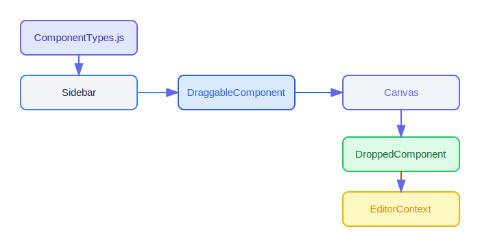

# Documentation: Drag-and-Drop Web Page Builder

## Project Overview

This documentation provides a comprehensive guide to the drag-and-drop web page builder project implemented in React with TailwindCSS. The project creates a visual interface where users can construct web pages by dragging and dropping pre-defined components onto a canvas.

## Technical Stack

- **Frontend Framework**: React
- **Build Tool**: Vite
- **Styling**: TailwindCSS
- **Drag and Drop**: react-dnd + react-dnd-html5-backend
- **Unique IDs**: uuid

## Folder Structure

```
web-builder/
├── node_modules/
├── public/
├── src/
│   ├── components/
│   │   ├── editor/
│   │   │   ├── Canvas.jsx            # Main drop target for components
│   │   │   ├── ComponentTypes.js     # Defines available component types
│   │   │   ├── DraggableComponent.jsx # Components that can be dragged from sidebar
│   │   │   ├── DroppedComponent.jsx  # Renders components once placed on canvas
│   │   │   └── EditorContext.jsx     # State management for the canvas
│   │   └── layout/
│   │       ├── AppLayout.jsx         # Overall application layout
│   │       ├── Header.jsx            # Top navigation bar
│   │       └── Sidebar.jsx           # Component selection panel
│   ├── App.jsx                       # Main application component
│   ├── index.css                     # Global styles (Tailwind directives)
│   └── main.jsx                      # Application entry point
├── .gitignore
├── index.html
├── package.json
├── tailwind.config.js                # Tailwind configuration
└── vite.config.js                    # Vite configuration
```

## Key Packages

- **react**: UI library for building the interface
- **react-dnd**: Library for drag-and-drop functionality
- **react-dnd-html5-backend**: HTML5 backend for react-dnd
- **uuid**: For generating unique IDs for components
- **tailwindcss**: Utility-first CSS framework

## Core Functionality Workflow

### 1. Drag and Drop Architecture


The drag and drop system is built on react-dnd, which implements the HTML5 Drag and Drop API. The workflow consists of:

1. **DndProvider**: Wraps the entire application in `App.jsx` and provides the HTML5Backend
2. **Draggable Items**: Components in the sidebar that users can drag
3. **Drop Target**: The canvas where components can be dropped
4. **State Management**: Context API to track what's on the canvas

### 2. Component Dragging Process

When a user drags a component from the sidebar:

1. The `DraggableComponent` in the sidebar uses `useDrag` hook to make it draggable
2. It provides metadata about the component (type, properties) as part of the drag payload
3. During dragging, visual feedback is shown (opacity change)

```jsx
// From DraggableComponent.jsx
const [{ isDragging }, drag] = useDrag(() => ({
  type: ItemTypes.COMPONENT, 
  item: { type: component.type, ...component.properties },
  collect: (monitor) => ({
    isDragging: !!monitor.isDragging(),
  }),
}));
```

### 3. Component Dropping Process

When the user drops a component on the canvas:

1. The `Canvas` component uses `useDrop` hook to accept dropped items
2. It calculates the drop position relative to the canvas
3. It calls `addComponent` from the EditorContext to update state
4. The new component is rendered at the specified position

```jsx
// From Canvas.jsx
const [{ isOver }, drop] = useDrop(() => ({
  accept: ItemTypes.COMPONENT,
  drop: (item, monitor) => {
    const offset = monitor.getClientOffset();
    const canvasRect = document.getElementById('canvas-container').getBoundingClientRect();
    const position = {
      x: offset.x - canvasRect.left,
      y: offset.y - canvasRect.top,
    };
    addComponent(item, position);
  },
  collect: (monitor) => ({
    isOver: !!monitor.isOver(),
  }),
}));
```

### 4. State Management Flow

The application uses React's Context API for state management:

1. `EditorContext` provides state and operations for components on the canvas
2. Components are stored as an array of objects, each with:
   - Unique ID (generated with uuid)
   - Component type
   - Component properties
   - Position coordinates

```jsx
// From EditorContext.jsx
const addComponent = (component, position) => {
  const newComponent = {
    id: uuidv4(),
    type: component.type,
    properties: { ...component },
    position,
  };

  setComponents([...components, newComponent]);
};
```

### 5. Component Rendering

Once dropped onto the canvas, components are rendered based on their type:

1. `DroppedComponent` receives the component data
2. It uses a switch statement to render different HTML based on component type
3. It positions the component absolutely using the position coordinates
4. It adds controls for manipulating the component (like delete buttons)

```jsx
// From DroppedComponent.jsx - partial example
const renderComponentByType = () => {
  const { type, properties } = component;
  
  switch (type) {
    case 'heading':
      const HeadingTag = properties.level || 'h2';
      return <HeadingTag className="text-xl font-bold">{properties.text}</HeadingTag>;
    
    case 'paragraph':
      return <p className="text-base">{properties.text}</p>;
    
    // More cases...
  }
};
```

## Visual Representation of Component Flow



1. **Component Definition**: Components are defined in `ComponentTypes.js`
2. **Sidebar Display**: Components are listed in the sidebar
3. **Drag Initiation**: User starts dragging a component
4. **Drop on Canvas**: Component is dropped at specific coordinates
5. **State Update**: EditorContext adds the component to state
6. **Render Component**: DroppedComponent renders based on type
7. **User Interaction**: User can delete or (in future) edit the component

## Comparison to shuffle.dev's Editor

The shuffle.dev editor (https://shuffle.dev/editor) has similar core functionalities but with additional features:

1. **Component Properties Panel**: Unlike our basic implementation, shuffle.dev has a dedicated properties panel for editing component attributes
2. **Grid System**: shuffle.dev uses a grid system for component placement, while our implementation uses absolute positioning
3. **Responsive Preview**: shuffle.dev offers responsive design preview options
4. **Code Export**: shuffle.dev can export to HTML/CSS/JS

## Future Enhancement Areas

To match the functionality of shuffle.dev's editor, consider these enhancements:

1. **Component Property Editor**: Add a panel for editing component properties
2. **Grid-Based Layout**: Replace absolute positioning with a grid system
3. **Component Resizing**: Add ability to resize components
4. **Component Nesting**: Enable components to be nested inside other components
5. **Export Functionality**: Add export to HTML/CSS/React code
6. **Responsive Design Tools**: Add tools to test and configure responsive behavior
7. **Undo/Redo**: Implement history management for actions

## Example User Flow

A typical user interaction with the application goes like this:

1. User browses components in the sidebar
2. User drags a heading component onto the canvas
3. The heading appears on the canvas at the drop location
4. User hovers over the component to reveal the delete button
5. User can delete the component if desired
6. User continues building their page by adding more components

## How to Extend the Project

### Adding New Component Types

To add a new component type:

1. Add the component definition to `ComponentTypes.js`:

```javascript
{
  type: 'newComponent',
  label: 'New Component',
  properties: {
    // Define default properties here
  },
},
```

2. Add rendering logic in `DroppedComponent.jsx`:

```javascript
case 'newComponent':
  return (
    <div className="custom-styling">
      {/* Render the new component */}
    </div>
  );
```

### Adding Component Editing

To enable component property editing:

1. Create a new `PropertyPanel.jsx` component
2. Add a `selectComponent` method to `EditorContext.jsx`
3. Update `DroppedComponent.jsx` to handle selection
4. Implement property form controls in the panel

## Conclusion

This drag-and-drop web page builder provides a foundation for creating a visual page builder similar to shuffle.dev. The current implementation showcases the core drag and drop functionality, component rendering, and basic state management. By following the enhancement recommendations, you can create a more full-featured product.

The modular architecture allows for easy extension and customization, making it suitable for various web design and prototyping scenarios.