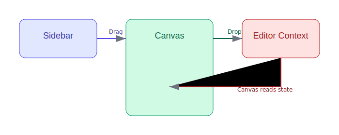

# Drag-and-Drop Web Page Builder Documentation

## Project Overview

This project is a drag-and-drop web page builder, similar in spirit to [Shuffle.dev](https://shuffle.dev/editor), built with React and TailwindCSS. Users can visually construct web pages by dragging components from a sidebar onto a canvas.

---

## Table of Contents

1. [Project Structure](#project-structure)
2. [Package Dependencies](#package-dependencies)
3. [How It Works](#how-it-works)
    - [Drag & Drop Architecture](#drag--drop-architecture)
    - [Component State Flow](#component-state-flow)
4. [Component Example Flow](#component-example-flow)
5. [Extending the Project](#extending-the-project)
6. [Visual Diagrams](#visual-diagrams)
7. [Comparison with Shuffle.dev](#comparison-with-shuffledev)
8. [Future Enhancements](#future-enhancements)
9. [How to Export This Documentation](#how-to-export-this-documentation)
---

## Project Structure

```
web-builder/
├── src/
│   ├── components/
│   │   ├── editor/
│   │   │   ├── Canvas.jsx
│   │   │   ├── ComponentTypes.js
│   │   │   ├── DraggableComponent.jsx
│   │   │   ├── DroppedComponent.jsx
│   │   │   └── EditorContext.jsx
│   │   └── layout/
│   │       ├── AppLayout.jsx
│   │       ├── Header.jsx
│   │       └── Sidebar.jsx
│   ├── App.jsx
│   ├── index.css
│   └── main.jsx
├── diagrams/
│   ├── drag-drop-architecture.svg
│   ├── component-state-flow.svg
│   └── component-flow.svg
...
```

---

## Package Dependencies

- **react** (UI framework)
- **tailwindcss** (utility-first CSS)
- **react-dnd** (drag-and-drop library)
- **react-dnd-html5-backend** (HTML5 drag-and-drop backend)
- **uuid** (for unique component IDs)

---

## How It Works

### Drag & Drop Architecture

When the user drags a component from the sidebar and drops it onto the canvas:

1. **DraggableComponent** (in Sidebar) uses `react-dnd`'s `useDrag` hook.
2. **Canvas** uses `useDrop` to accept components.
3. **EditorContext** manages a list of dropped components and their positions.
4. **DroppedComponent** renders the component at the drop location.



---

### Component State Flow

- All dropped components are stored in context (`EditorContext`).
- Each dropped component contains:
    - A unique id
    - Type (e.g., heading, button)
    - Properties (e.g., text, color)
    - Position (x, y)

#### State Diagram


---

## Component Example Flow

1. User drags a **Heading** from the sidebar.
2. The drag event carries the type and default properties.
3. On drop, the canvas calculates position and calls `addComponent`.
4. State is updated, and the heading renders on the canvas.

**Illustration:**


---

## Extending the Project

To add a new component:

1. Add a new entry to `ComponentTypes.js`
2. Add rendering logic in `DroppedComponent.jsx`
3. Optionally, extend `EditorContext` for new behaviors

---

## Visual Diagrams

### 1. Drag-and-Drop Architecture


### 2. Component State Flow


### 3. Component Flow


---

## Comparison with Shuffle.dev

- **Shuffle.dev** offers grid systems, property panels, and code export.
- **This project** currently offers basic drag/drop and absolute positioning.
- **You can extend** with property panels, grid layouts, and export features to approach Shuffle.dev’s capabilities.

---

## Future Enhancements

- Component property editing panel
- Responsive/grid layouts
- Export to HTML/JSX
- Undo/Redo
- Nested components

---

## How to Export This Documentation

1. **With VS Code:**
   - Install the “Markdown PDF” extension.
   - Open this file, right-click, choose “Markdown PDF: Export (pdf)” (or “Export (docx)”).

2. **With Pandoc:**
   - Install Pandoc.
   - Run:  
     ```
     pandoc -o web-builder-documentation.pdf web-builder-documentation.md
     ```
   - For DOCX:  
     ```
     pandoc -o web-builder-documentation.docx web-builder-documentation.md
     ```

**Make sure the `diagrams/` directory and images are present for diagrams to appear in the exported file.**

---

## Credits

- Inspired by [Shuffle.dev](https://shuffle.dev/)
- Built with React, TailwindCSS, and react-dnd
